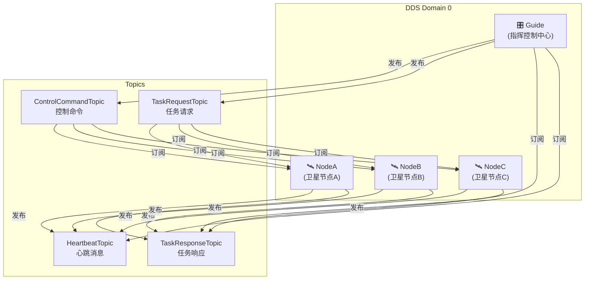
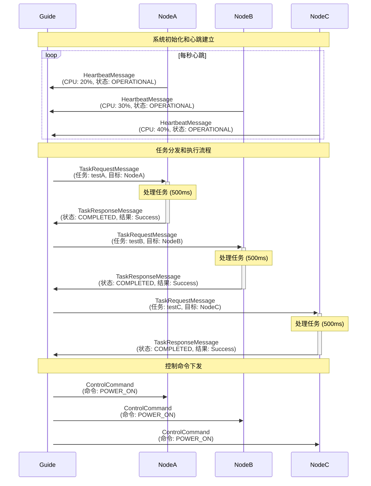
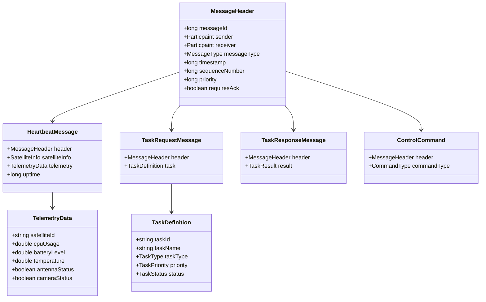
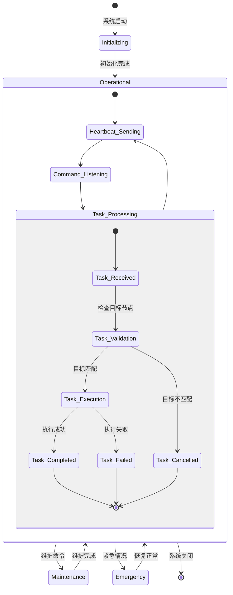

# 多卫星通信与任务调度系统

## 📋 项目概述

这是一个基于RTI DDS（Data Distribution Service）的多卫星分布式通信与任务调度系统。该系统模拟了卫星星座中的指挥控制中心（Guide）与多个卫星节点（NodeA、NodeB、NodeC）之间的实时通信、任务分发和状态监控。

## 🏗️ 系统架构

### 核心组件

| 组件 | 角色 | 功能描述 |
|------|------|----------|
| **Guide** | 指挥控制中心 | 任务调度、指令下发、状态监控 |
| **NodeA/B/C** | 卫星节点 | 任务执行、状态上报、指令响应 |
| **MultiDomainNode** | 通信框架 | DDS消息路由与处理 |

## 📡 通信架构



## 🔄 消息流程



## 📊 数据模型



## 🎯 业务逻辑详解

### 1. 系统初始化流程
```cpp
// 每个节点的初始化过程
MultiDomainNode node;
node.initDomains({0}, true);  // 初始化DDS域
node.setCmdHandler(...);      // 设置命令处理器
node.setTaskRequestHandler(...); // 设置任务请求处理器
node.initSubscribers();       // 初始化订阅者
node.initPublishers();        // 初始化发布者
```

### 2. 心跳监控机制
- **频率**: 每秒一次
- **内容**: 卫星状态、遥测数据、系统健康信息
- **目的**: 实时监控卫星节点运行状态

```cpp
// 心跳消息示例
heartbeat::HeartbeatMessage msg;
msg.header().sender(Particpaint::NodeA);
msg.satelliteInfo().status(OPERATIONAL);
msg.telemetry().cpuUsage(20.0);
```

### 3. 任务调度与执行

#### 任务分发策略
- Guide根据任务需求向特定卫星节点发送任务请求
- 支持多种任务类型：成像、通信、导航、科学实验等
- 任务具有优先级管理机制

#### 任务执行流程
1. **任务接收**: 卫星节点检查任务目标是否为自己
2. **任务处理**: 模拟执行时间（500ms）
3. **结果响应**: 返回任务执行结果和状态

```cpp
// 任务处理逻辑
if(request.header().receiver() != Particpaint::NodeA) {
    response.result().status(CANCELLED);
    return response;
}
// 执行任务...
response.result().status(COMPLETED);
response.result().resultData("Task completed successfully");
```

### 4. 控制命令系统
支持的命令类型：
- `POWER_ON` - 开机
- `POWER_OFF` - 关机  
- `RESET` - 重置
- `RECONFIGURE` - 重新配置
- `CALIBRATE` - 校准
- `EMERGENCY_STOP` - 紧急停止

## 🔧 技术特性

### DDS通信特性
- **实时性**: 低延迟的点对点和发布-订阅通信
- **可靠性**: 支持可靠传输和历史数据保持
- **可扩展性**: 动态节点发现和加入
- **类型安全**: IDL定义的强类型系统

### 回调处理机制
```cpp
// 消息处理器模式
using CmdHandler = std::function<void(const cmd::ControlCommand&)>;
using TaskRequestHandler = std::function<task::TaskResponseMessage(const task::TaskRequestMessage&)>;

// 设置处理器
node.setCmdHandler([](const cmd::ControlCommand& cmd) {
    // 处理控制命令
});
```

### 消息路由架构
- **MultiDomainNode**: 核心通信框架
- **Publisher/Subscriber**: DDS发布订阅封装
- **模板特化**: 针对不同消息类型的专用处理

## 📈 系统状态流转



## 🚀 快速开始

### 环境要求
- RTI Connext DDS 5.2.3+
- C++11兼容编译器
- CMake 3.5+

### 编译构建
```bash
# 创建构建目录
mkdir -p build && cd build

# 生成构建文件
cmake ..

# 编译项目
make
```

### 运行系统

#### 1. 启动指挥控制中心
```bash
./Guide
```

#### 2. 启动卫星节点（新终端）
```bash
# 启动NodeA
./NodeA

# 启动NodeB（新终端）
./NodeB

# 启动NodeC（新终端）
./NodeC
```

### 运行效果示例
```
Guide输出:
send msg
Guide received heartbeat from: 0, CPU usage: 20%, uptime: 1000ms
Guide received task response: TaskID=TASK_0, Status=2, Result=Task completed successfully by NodeA

NodeA输出:
send msg
NodeA received command: 0
NodeA processing task: testA
NodeA task completed, sending response
```

## 📁 项目结构

```
RTI_DDS_5.2.3/demo/
├── type/                     # IDL类型定义
│   ├── MessageHeader.idl     # 消息头定义
│   ├── Command.idl          # 控制命令定义
│   ├── Task.idl             # 任务相关定义
│   └── Heartbeat.idl        # 心跳消息定义
├── MultiDomainNode.hpp      # 多域节点头文件
├── MultiDomainNode.cxx      # 多域节点实现
├── Publisher.hpp            # 发布者框架
├── Subscriber.hpp           # 订阅者框架
├── Guide.cxx               # 指挥控制中心
├── NodeA.cxx               # 卫星节点A
├── NodeB.cxx               # 卫星节点B
├── NodeC.cxx               # 卫星节点C
├── application.hpp         # 应用框架
├── CMakeLists.txt          # 构建配置
└── README.md               # 项目文档
```

## 📊 性能特征

| 指标 | 数值 | 说明 |
|------|------|------|
| 心跳频率 | 1Hz | 每秒一次状态上报 |
| 任务处理时间 | 500ms | 模拟任务执行延迟 |
| 消息可靠性 | 可靠传输 | DDS Reliable QoS |
| 并发处理 | 多线程 | 异步消息处理 |
| 支持节点数 | 可扩展 | 动态节点发现 |

## 🔧 配置选项

### DDS传输配置
可在编译时通过宏定义选择传输方式：
- `UDP_V4`: UDP传输（默认）
- `TCP_V4`: TCP传输
- `SHM`: 共享内存传输
- `DISCOVER`: 服务发现模式

### 编译示例
```bash
# 使用TCP传输
cmake -DTCP_V4=ON ..

# 使用共享内存
cmake -DSHM=ON ..

# 启用服务发现
cmake -DDISCOVER=ON ..
```

## 🔮 扩展方向

### 功能扩展
- **故障恢复**: 节点故障检测和自动恢复
- **负载均衡**: 任务动态分配策略
- **安全机制**: 消息加密和身份认证
- **可视化**: 实时状态监控界面

### 架构演进
- **多域通信**: 支持跨域节点通信
- **服务发现**: 动态服务注册和发现
- **配置管理**: 运行时参数动态调整
- **日志审计**: 完整的操作日志系统

## 📝 开发指南

### 添加新的消息类型
1. 在`type/`目录下创建新的IDL文件
2. 使用`rtiddsgen`生成C++代码
3. 在`MultiDomainNode`中添加对应的处理器类型
4. 实现消息特化处理逻辑

### 添加新的节点
1. 复制现有节点代码（如NodeA.cxx）
2. 修改节点标识符和处理逻辑
3. 在CMakeLists.txt中添加构建目标

## 🐛 故障排除

### 常见问题
1. **编译错误**: 检查RTI DDS环境变量和头文件路径
2. **运行时连接失败**: 确认所有节点在同一DDS域中
3. **消息丢失**: 检查QoS配置和网络连接

### 调试技巧
- 使用`rtiddsspy`监控DDS通信
- 启用DDS日志获取详细信息
- 检查防火墙和网络配置

## 📄 许可证

本项目仅用于学习和研究目的。

## 🤝 贡献

欢迎提交Issue和Pull Request来完善这个项目。

---

**本系统展示了基于DDS的分布式卫星通信架构，具备高可靠性、实时性和可扩展性，为复杂的航天任务调度提供了坚实的技术基础。**
