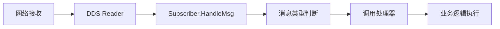
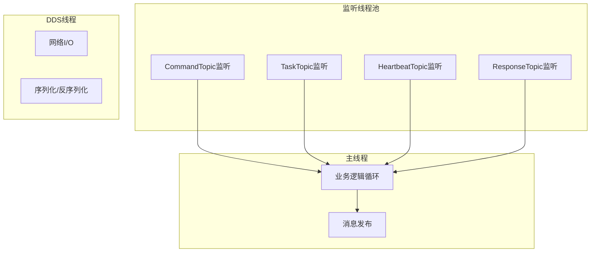

# 系统架构设计文档

## 概览

本文档详细描述了多卫星通信与任务调度系统的技术架构、设计原则和实现细节。

## 架构设计原则

### 1. 分离关注点
- **通信层**: MultiDomainNode负责DDS消息路由
- **业务层**: 各节点实现具体的业务逻辑
- **数据层**: IDL定义标准化的数据结构

### 2. 事件驱动架构
- 基于DDS发布-订阅模式
- 异步消息处理
- 回调机制解耦业务逻辑

### 3. 类型安全
- IDL强类型定义
- 编译时类型检查
- 模板特化消息处理

## 核心组件详解

### MultiDomainNode
```cpp
class MultiDomainNode {
    // DDS参与者管理
    std::map<int, std::shared_ptr<Publisher>> m_publishers;
    std::map<int, std::shared_ptr<Subscriber>> m_subscribers;
    
    // 消息处理器
    CmdHandler m_cmdHandler;
    TaskRequestHandler m_taskRequestHandler;
    TaskResponseHandler m_taskResponseHandler;
    HeartbeatHandler m_heartbeatHandler;
};
```

**职责**:
- DDS域初始化和管理
- Topic配置和路由
- 消息处理器注册和调用
- 发布者/订阅者生命周期管理

### Publisher组件
```cpp
template <typename T>
class WriterHolder : public BaseWriterHolder {
    dds::pub::DataWriter<T> writer;
public:
    void write(const T& data);
};
```

**特性**:
- 泛型设计支持多种数据类型
- RAII资源管理
- QoS配置支持

### Subscriber组件
```cpp
template <typename T>
void Subscriber::HandleMsg(dds::sub::DataReader<T> reader) {
    // 泛型处理逻辑
}

// 特化处理
template <>
void Subscriber::HandleMsg<cmd::ControlCommand>(...) {
    // 命令专用处理逻辑
}
```

**特性**:
- 模板特化机制
- 异步监听线程
- 自动消息路由

## 消息处理流程

### 1. 消息发布流程


### 2. 消息订阅流程


## 数据流架构

### Topic设计
| Topic名称 | 数据类型 | 发布者 | 订阅者 | 用途 |
|-----------|----------|--------|--------|------|
| ControlCommandTopic | ControlCommand | Guide | NodeA/B/C | 控制命令下发 |
| TaskRequestTopic | TaskRequestMessage | Guide | NodeA/B/C | 任务分发 |
| TaskResponseTopic | TaskResponseMessage | NodeA/B/C | Guide | 任务结果上报 |
| HeartbeatTopic | HeartbeatMessage | NodeA/B/C | Guide | 状态监控 |

### QoS配置策略
```cpp
dds::sub::qos::DataReaderQos qos;
qos << dds::core::policy::Reliability::Reliable()        // 可靠传输
    << dds::core::policy::History::KeepAll()             // 保持所有历史
    << dds::core::policy::Durability::TransientLocal();  // 瞬态本地持久化
```

## 消息路由机制

### 回调注册
```cpp
// 类型安全的回调注册
using CmdHandler = std::function<void(const cmd::ControlCommand&)>;
void setCmdHandler(CmdHandler handler) { m_cmdHandler = handler; }
```

### 消息分发
```cpp
// Subscriber中的消息分发逻辑
template <>
void HandleMsg<cmd::ControlCommand>(DataReader<cmd::ControlCommand> reader) {
    auto samples = reader.take();
    for (const auto& sample : samples) {
        if (sample.info().valid() && m_node && m_node->getCmdHandler()) {
            m_node->getCmdHandler()(sample.data());  // 调用注册的处理器
        }
    }
}
```

## 并发设计

### 线程模型


### 线程安全
- **无锁设计**: 基于DDS的内置线程安全
- **回调隔离**: 每个消息类型独立的处理线程
- **状态一致性**: 原子操作和RAII保证

## 错误处理策略

### 1. 网络层错误
- DDS自动重连机制
- QoS策略保证消息可靠性
- 超时检测和处理

### 2. 应用层错误
```cpp
// 任务处理错误处理
try {
    auto response = processTask(request);
    return response;
} catch (const std::exception& e) {
    TaskResponseMessage errorResponse;
    errorResponse.result().status(FAILED);
    errorResponse.result().errorMessage(e.what());
    return errorResponse;
}
```

### 3. 类型安全错误
- 编译时类型检查
- 运行时类型验证
- 优雅降级处理

## 性能优化

### 1. 内存管理
- **零拷贝**: DDS支持的零拷贝传输
- **对象池**: 重用消息对象
- **RAII**: 自动资源管理

### 2. 网络优化
- **批量传输**: 聚合小消息
- **压缩**: 可选的数据压缩
- **QoS调优**: 针对不同消息类型的QoS优化

### 3. 处理器优化
```cpp
// 高频消息的优化处理
template <>
void HandleMsg<heartbeat::HeartbeatMessage>(...) {
    // 最小化处理逻辑
    // 避免阻塞操作
    // 使用轻量级回调
}
```

## 可扩展性设计

### 1. 新节点接入
```cpp
// 只需实现标准接口
MultiDomainNode newNode;
newNode.setCmdHandler(...);
newNode.setTaskRequestHandler(...);
// 自动发现和通信
```

### 2. 新消息类型
1. 定义IDL结构
2. 生成C++代码
3. 添加处理器类型
4. 实现特化处理

### 3. 多域支持
```cpp
// 支持跨域通信
std::vector<int> domains = {0, 1, 2};
node.initDomains(domains);
```

## 监控和调试

### 1. 内置监控
- 心跳机制监控节点状态
- 任务执行时间统计
- 消息传输质量监控

### 2. 外部工具
- **rtiddsspy**: 实时监控DDS通信
- **rtiddsgen**: 代码生成和验证
- **Admin Console**: 图形化监控界面

### 3. 日志系统
```cpp
// 结构化日志
std::cout << "NodeA processing task: " << request.task().taskName() 
          << " at " << app::getCurrentMilliseconds() << "ms" << std::endl;
```

## 安全考虑

### 1. 数据完整性
- DDS内置的CRC校验
- 消息序列号验证
- 超时和重传机制

### 2. 访问控制
- 基于Topic的权限控制
- 参与者身份验证
- 数据加密传输（可选）

### 3. 故障隔离
- 节点故障不影响整体系统
- 优雅降级处理
- 自动故障恢复

## 部署架构

### 单机部署
```
[Guide] ←→ [DDS Discovery]
   ↑              ↓
[NodeA] ←→ [NodeB] ←→ [NodeC]
```

### 分布式部署
```
[机房A: Guide + NodeA] ←→ [网络] ←→ [机房B: NodeB + NodeC]
                               ↓
                        [Discovery Server]
```

## 总结

本架构通过以下设计实现了高性能、高可靠的分布式卫星通信系统：

1. **模块化设计**: 清晰的职责分离和接口定义
2. **事件驱动**: 基于DDS的异步消息处理
3. **类型安全**: IDL和模板系统保证类型安全
4. **高性能**: 零拷贝、并发处理、QoS优化
5. **可扩展**: 支持动态节点加入和新消息类型
6. **容错性**: 多层次的错误处理和恢复机制

这种架构为复杂的航天任务调度提供了坚实可靠的技术基础。
